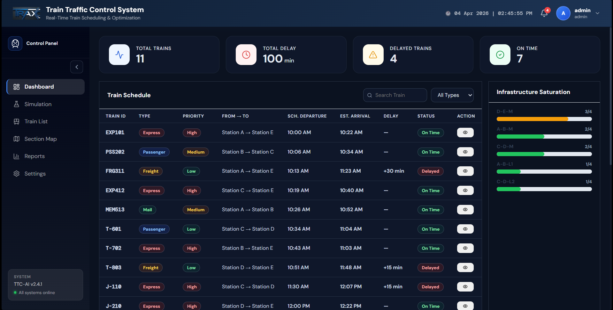
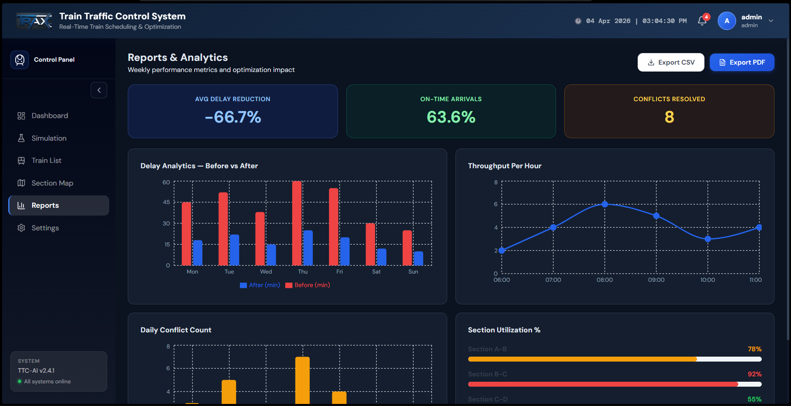

# TRAX: Railway Traffic Control & Optimization System

[](https://reactjs.org/)
[](https://tailwindcss.com/)
[](https://fastapi.tiangolo.com/)
[](https://www.python.org/)
[](https://developers.google.com/optimization)

## Overview
TRAX is an enterprise-grade Railway Traffic Control dashboard designed to simulate, monitor, and optimize train schedules across a multi-node transit network. Powered by Google's OR-Tools (CP-SAT solver) on the backend and a high-performance React SVG engine on the frontend, TRAX mathematically resolves scheduling conflicts, enforces physical routing constraints, and provides real-time telemetry to Section Controllers.

| Dashboard |   Reports   |
| :---: | :---: |
|  |  |


## Core Features
* **Constraint Programming Engine:** Utilizes a CP-SAT solver to automatically generate conflict-free schedules. Supports three dynamic optimization objectives: *Minimize Delay*, *Maximize Throughput*, and *Balanced Mode*.
* **Functional Topology Routing:** Physically segregates high-speed Express/Freight traffic onto bypass **Mainlines** while routing Passenger traffic into docking **Loop Lines**.
* **Live SVG Section Map:** A custom-built, mathematically scaled interactive map featuring dynamic platform capacity indicators, anti-collision train layout algorithms, and deep-dive telemetry tooltips.
* **Real-Time Network Telemetry:** Live dashboards displaying Track Saturation, Delay Analytics, and critical system alerts.
* **Infrastructure Simulation:** Allows dispatchers to inject delays, change platform capacities, or block physical track sections to test network resilience and trigger automatic re-optimization.

---

## Architecture & Tech Stack

The repository is strictly divided into two decoupled services:

### Frontend (`/frontend`)
* **Framework:** React.js (via Vite)
* **Styling:** Tailwind CSS + Semantic Global CSS
* **State & Data Fetching:** React Hooks + Fetch API (JWT Intercepted)
* **Data Visualization:** Native SVG DOM manipulation & Recharts

### Backend (`/backend`)
* **Framework:** FastAPI (Python)
* **Optimization Engine:** Google OR-Tools (`cp_model`)
* **Database:** SQLite (via SQLAlchemy ORM)
* **Authentication:** JWT (JSON Web Tokens) with Role-Based Access Control (RBAC)

---

## Getting Started

### Prerequisites
* **Node.js** (v18.0 or higher)
* **Python** (v3.10 or higher)

### 1. Backend Setup

Open a terminal in the root directory of the project:

```bash
# Create and activate a virtual environment
python -m venv venv
source venv/bin/activate  # On Windows use: venv\Scripts\activate

# Install required Python packages
pip install fastapi uvicorn sqlalchemy ortools pydantic PyJWT passlib[bcrypt] python-multipart

# Set up environment variables
# Create a .env file in the root directory and add a secure cryptographic key:
echo "TRAX_SECRET_KEY=$(python -c 'import secrets; print(secrets.token_urlsafe(32))')" > .env

# Seed the database with the initial track topology and train roster
python -m backend.seed

# Start the FastAPI server
uvicorn backend.main:app --reload
```
The backend API will now be running at <http://127.0.0.1:8000.>

### 2. Frontend Setup

Open a new terminal in the root directory:
```bash 
# Navigate to the frontend directory
cd frontend

# Install Node dependencies
npm install

# Start the Vite development server
npm run dev
```
The React application will be available at http://localhost:5173.

---
## Default Credentials

Running the backend.seed script automatically generates a master administrator account. Use these credentials to log into the TRAX dashboard:

**Username:** admin

**Password:** trax2026


*(**Note**: It is highly recommended to change this password in a production environment).*

---
## Usage Guide

**Dashboard Overview:** Upon logging in, the Section Controller is presented with the live network state, including active delays and track saturation metrics.

**Section Map:** Navigate to the Map tab to view the physical layout of the trains. Hover over trains or station cards for exact scheduling deviations and platform utilization.

**Simulation & Optimization:** Use the Simulation panel to add a new train to the network or inject a delay. The backend CP-SAT solver will automatically recalculate the global schedule and push the updated, conflict-free routes to the map.

**Engine Configuration:** Admins can use the Settings panel to alter the CP-SAT engine's objective function, adjust global headway times, or manipulate train priority weights.

---
## Project Structure

```
TRAX/
├── backend/
│   ├── __init__.py
│   ├── main.py          # FastAPI application & route definitions
│   ├── models.py        # SQLAlchemy database schemas
│   ├── optimizer.py     # CP-SAT constraint programming logic
│   ├── security.py      # JWT Auth & Role-Based Access Control
│   └── seed.py          # Database initialization & topology injection
├── frontend/
│   ├── public/
│   ├── src/
│   │   ├── components/  # Reusable UI widgets (Navbar, Sidebar, Maps)
│   │   ├── pages/       # Core views (Dashboard, SectionMap, Simulation, Settings)
│   │   ├── utils/       # API interceptors and helpers
│   │   ├── App.jsx
│   │   └── main.jsx
│   ├── package.json
│   └── tailwind.config.js
├── .env                 # Secret keys and environment variables
├── .gitignore
└── README.md
```
